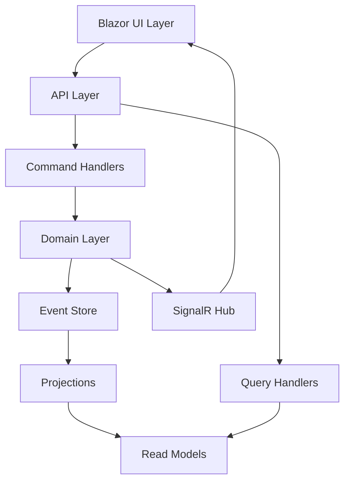
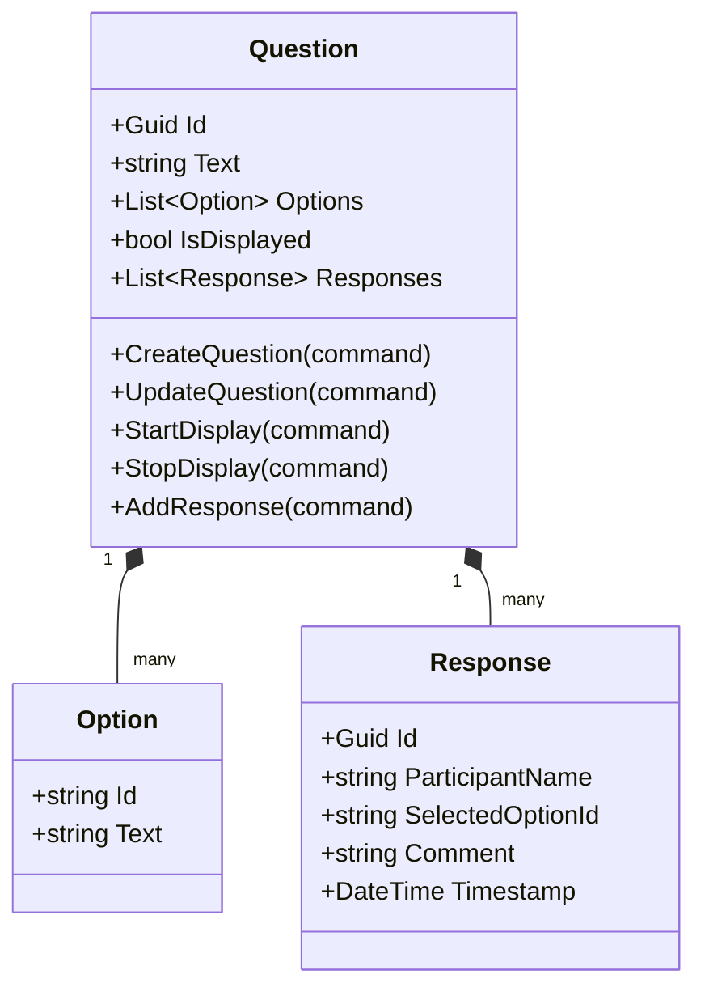
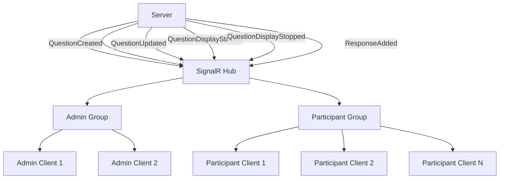

# System Patterns: EsCQRSQuestions

## System Architecture

EsCQRSQuestions follows a clean architecture approach with a clear separation of concerns, built around event sourcing and CQRS principles. The system is divided into several key layers:



### Layers

1. **UI Layer (Blazor)**
   - Presentation components for admin and participant views
   - SignalR client for real-time updates
   - State management for UI components

2. **API Layer**
   - HTTP endpoints for commands and queries
   - SignalR hub for real-time communication
   - Authentication and authorization (basic)

3. **Command Handlers**
   - Process commands from the API
   - Validate command data
   - Apply business rules
   - Generate and persist events

4. **Domain Layer**
   - Core business logic
   - Aggregate definitions (Question)
   - Event definitions
   - Domain services

5. **Event Store**
   - Persistent storage for all events
   - Event retrieval for rebuilding aggregates
   - Implemented using Sekiban

6. **Projections**
   - Transform events into read models
   - Update read models when new events occur
   - Optimize data for querying

7. **Read Models**
   - Denormalized views of the data
   - Optimized for specific query scenarios
   - In-memory or persisted depending on needs

8. **Query Handlers**
   - Retrieve data from read models
   - Format data for API responses

## Key Technical Decisions

### Event Sourcing with Sekiban
- All state changes are captured as events
- The event store is the source of truth
- Aggregates are reconstructed by replaying events
- Sekiban framework provides the infrastructure for event sourcing

### CQRS Pattern
- Separate command and query responsibilities
- Commands change state but return no data
- Queries return data but don't change state
- Different models for writing and reading

### Real-time Communication with SignalR
- Push notifications to clients when state changes
- Clients subscribe to specific channels
- Low latency updates for real-time interaction

### Blazor for Frontend
- Component-based UI architecture
- Server-side rendering for initial load
- Client-side interactivity for responsive UX
- Reusable components for consistent UI

## Design Patterns in Use

### Aggregate Pattern
- Question as the primary aggregate
- Encapsulates related data and behavior
- Ensures consistency boundaries
- Responsible for validating commands and generating events

### Repository Pattern
- Abstracts data access logic
- Provides methods to load and save aggregates
- Implemented by Sekiban framework

### Command Pattern
- Encapsulates a request as an object
- Decouples sender from receiver
- Enables validation, logging, and queuing

### Observer Pattern (via SignalR)
- Subjects (server events) notify observers (clients)
- Observers (clients) subscribe to subjects
- Enables loose coupling between components

### Projection Pattern
- Transforms events into read models
- Updates read models when new events occur
- Optimizes data for specific query scenarios

## Component Relationships

### Question Aggregate
The central aggregate in the system, representing a survey question with its options and responses.



### Event Flow

```mermaid
sequenceDiagram
    participant Admin
    participant API
    participant Domain
    participant EventStore
    participant SignalR
    participant Participant
    
    Admin->>API: Create Question Command
    API->>Domain: Process Command
    Domain->>EventStore: Store QuestionCreated Event
    Domain->>SignalR: Notify Clients
    
    Admin->>API: Start Display Command
    API->>Domain: Process Command
    Domain->>EventStore: Store QuestionDisplayStarted Event
    Domain->>SignalR: Notify Clients
    SignalR->>Participant: Update UI
    
    Participant->>API: Submit Response Command
    API->>Domain: Process Command
    Domain->>EventStore: Store ResponseAdded Event
    Domain->>SignalR: Notify Clients
    SignalR->>Admin: Update Statistics
    SignalR->>Participant: Update Other Participants' View
    
    Admin->>API: Stop Display Command
    API->>Domain: Process Command
    Domain->>EventStore: Store QuestionDisplayStopped Event
    Domain->>SignalR: Notify Clients
    SignalR->>Participant: Return to Welcome Screen
```

### SignalR Communication



## Technical Implementation Details

### Event Types
- **QuestionCreated**: Initial creation of a question
- **QuestionUpdated**: Modification of question text or options
- **QuestionDisplayStarted**: Question made visible to participants
- **QuestionDisplayStopped**: Question hidden from participants
- **ResponseAdded**: Participant submitted a response

### Command Types
- **CreateQuestionCommand**: Create a new question with options
- **UpdateQuestionCommand**: Modify an existing question
- **StartDisplayCommand**: Make a question visible to participants
- **StopDisplayCommand**: Hide a question from participants
- **AddResponseCommand**: Submit a response to a question

### Read Models
- **QuestionSummaryReadModel**: Basic information about questions
- **ActiveQuestionReadModel**: Currently displayed question
- **QuestionStatisticsReadModel**: Aggregated response data
- **ParticipantResponseReadModel**: Individual participant responses
